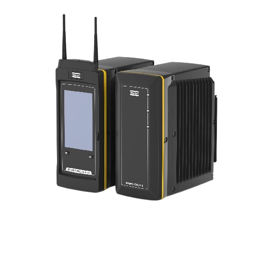

# 🔌 Px2 Connect Browser Extension

<div align="center">
  
</div>

## 🌟 Features

- 🚀 Quick access to your PX2 device
- 🎯 Default IP (169.254.1.1) connection
- ✨ Custom IP or hostname support
- 🎨 Dark mode interface
- 💼 Easy-to-use options page

## 📥 Installation

Since this extension isn't distributed through the Chrome Web Store, you can install it in two ways:

### Manual Installation
1. Download the latest release from the [Releases](../../releases) page
2. Open your Chrome-based browser (Chrome, Edge, Brave, etc.)
3. Go to the extensions page:
   - Chrome: `chrome://extensions`
   - Edge: `edge://extensions`
   - Brave: `brave://extensions`
4. Enable "Developer mode" (top right corner)
5. Drag and drop the downloaded `.zip` file into the browser window

### Build from Source
1. Clone this repository:
   ```bash
   git clone https://github.com/YourUsername/px2-connect.git
   ```
2. Open your browser's extension page
3. Enable "Developer mode"
4. Click "Load unpacked"
5. Select the extension directory

## 🛠️ Usage

1. Click the extension icon in your browser toolbar
2. Choose between:
   - Default IP (169.254.1.1)
   - Custom IP or hostname

### Configuration
1. Right-click the extension icon
2. Select "Options"
3. Choose your preferred connection method:
   - Default IP
   - Custom IP address
   - Custom hostname

## 🔄 Updates

New versions will be available through the [Releases](../../releases) page. To update:
1. Download the latest version
2. Remove the existing extension
3. Install the new version following the installation steps

## 🤝 Contributing

Feel free to:
- Open issues
- Submit pull requests
- Suggest improvements

## 📄 License

[MIT License](LICENSE)

---

<div align="center">
  <i>Built with ❤️ for easy device access</i>
</div>